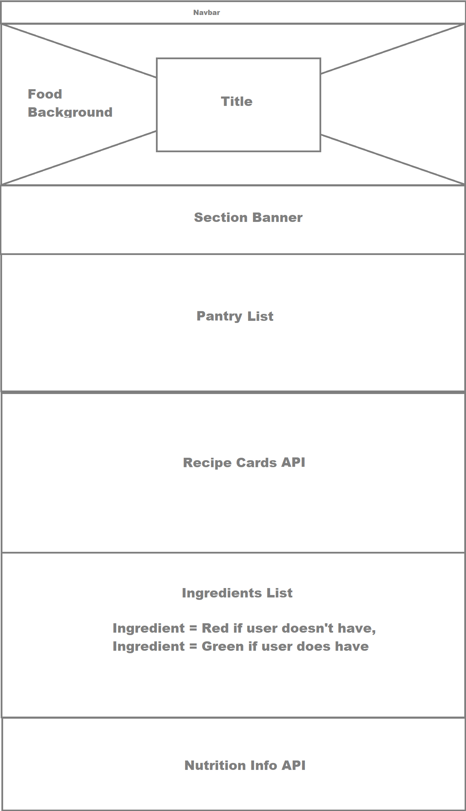

# [Recipe Master!](https://sdemkovich.github.io/Recipe-Master/)

## Project Description
Recipe Master allows a user to enter ingredients they have at home into a "Pantry List". Using these ingredients, the user will search for 4 recipe's at a time from Recipe Puppy API that will be displayed in Bulma cards. Clicking on a recipe will both take you to the recipe URL and display the ingredients of the recipe. Ingredients that the user has on the pantry list will be highlighted green, while ingredients the user doesn't have will be highlighted red. Clicking on any ingredient will bring up the nutrition info provided by the USDA Food Data API.

## User Story  
As a user, I want to make meals with the food I have at home, so that I can save  money, reduce waste, and eat healthy.

## Wireframe

Created by: Chris Bragg, Sveta Demkovich, Daniel Villarroel  

  

# API's consumed
- Recipe Puppy  
- U.S. Department of Agriculture FoodData Central  

# Links  
[Presentation](./recipePPT.pptx)/  
[Project proposal](https://drive.google.com/open?id=15hsFwbAiv-9XK9aorcIa0fySlPHRG8v8wnyfxlYu3Bc)  

## Latest Commit  
-Modified demo gif link  

## Previous commits  
-Modified ReadMe  
-Added PPT presentation  
-Modified front end for recipe card and ingredient sections  
-Additional pantry search error handling  
-Added recipe card functionality  
-Added recipe ingredients functionality  
-Changed on click handler for ingredients to new class  
-Added media queries to change margins based on screen width  
-Moved all script into document ready for jQuery  
-Added on click handler for recipe cards to display ingredients   
-Modified div classes for responsiveness  
-Added lower banner  
-Modified Pantry Search, Pantry List, and background  
-Modify HTML/CSS for UI  
-Error handling to display "N/A" if nutrient is not found  
-Added kcal units to Calories  
-Added Fiber and Cholesterol  
-Created temporary html tags that will display nutrient info  
-Created temporary html buttons that hold recipe ingredients  
-Created event handler on recipe buttons  
-Created AJAX call to search food title of recipe button  
-Created functions to handle AJAX response and update html tags with nutrient info
-Modified shape and color of buttons created into pantry list
-Added logic to prevent from submiting an empty string into pantry search
